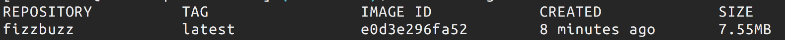

# seccamp-b3-docker

セキュキャン2018 B3 事前課題2
```
1つめのGitHubリポジトリをgitのsubmoduleとして登録したリポジトリ。
Dockerfileを作成し、1つめのFizzBuzzサーバが起動できるようにする。
$ docker run -d -p 8080:8080 fizzbuzz
のようなコマンドを打ったら1つめのサーバが動作し、HTTPリクエストを受け付けられる状態にする。
余裕があればDockerのイメージサイズが10MB以内になるようにする。
```


